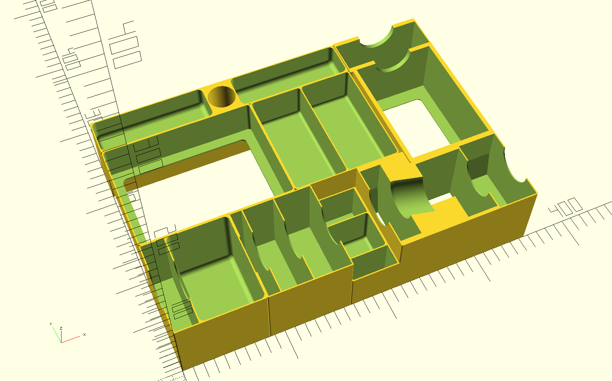

# Organizer for Lost Ruins of Arnak

OpenSCAD files for the retail edition of [Lost Ruins of Arnak](https://boardgamegeek.com/boardgame/312484/lost-ruins-arnak) with both expansions.
Supports thin sleeved cards.

I use [Unserfamily's temple tray](https://www.thingiverse.com/thing:4740139) with this insert.

The insert was designed for 3d printing. Walls are 3 lanes thick, the bottom is 5 layers thick.

## Printer settings
  
- 0.4 nozzle
- 0.2 layer height

## Assembly

  
