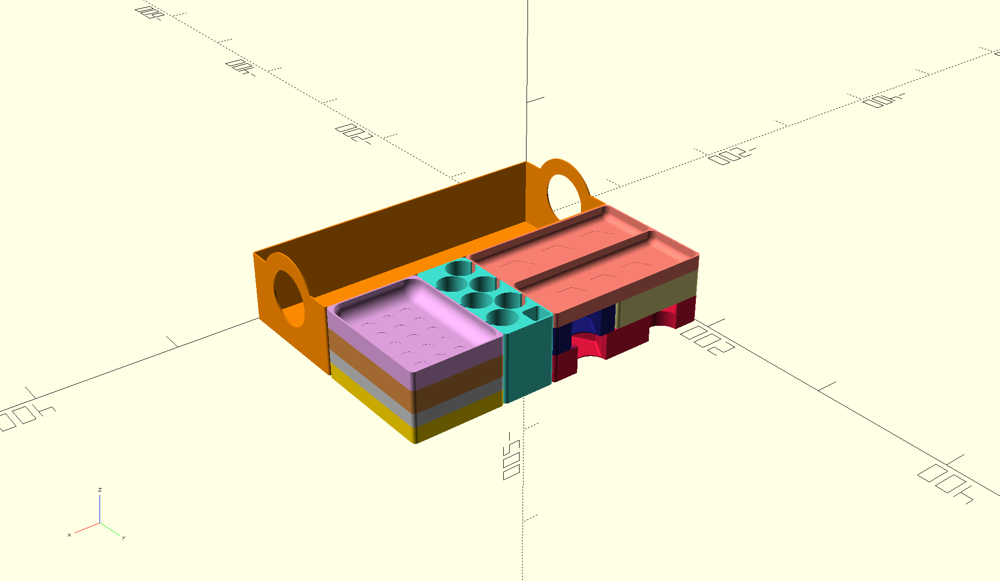
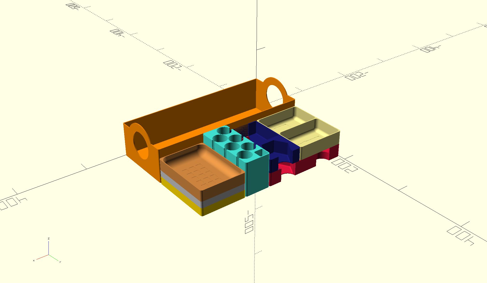
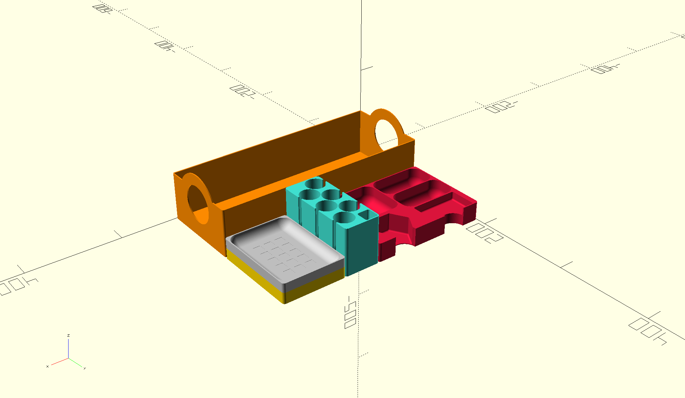

# Organizer for Terraforming Mars: Ares Expedition

OpenSCAD files for the retail edition of [Terraforming Mars: Ares Expedition](https://boardgamegeek.com/boardgame/328871/terraforming-mars-ares-expedition) with all three expansions.
Does not support sleeved cards. The insert is designed to fit in the retail box, not for the larger expansion box. 

The insert was designed for 3d printing. Walls are 3 lanes thick, the bottom is 4 layers thick.

## Printer settings
  
- 0.4 nozzle
- 0.2 layer height

That can be adjusted via the variables in the source code, I only tested it with these settings though.

## Assembly

  
  

